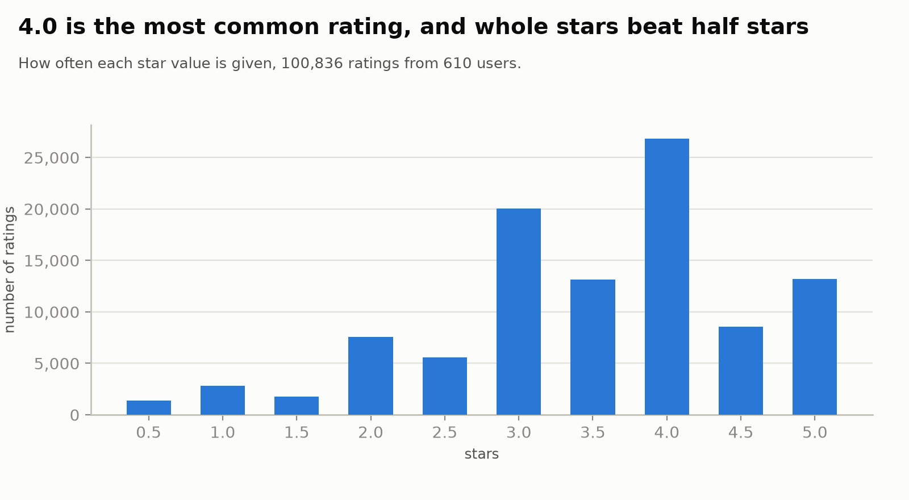
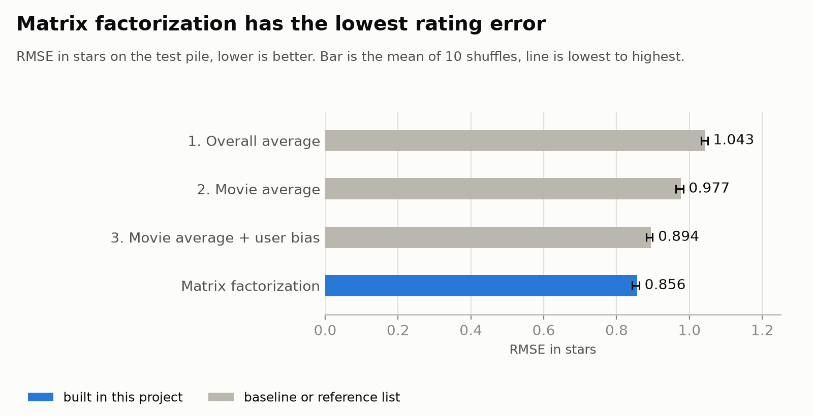
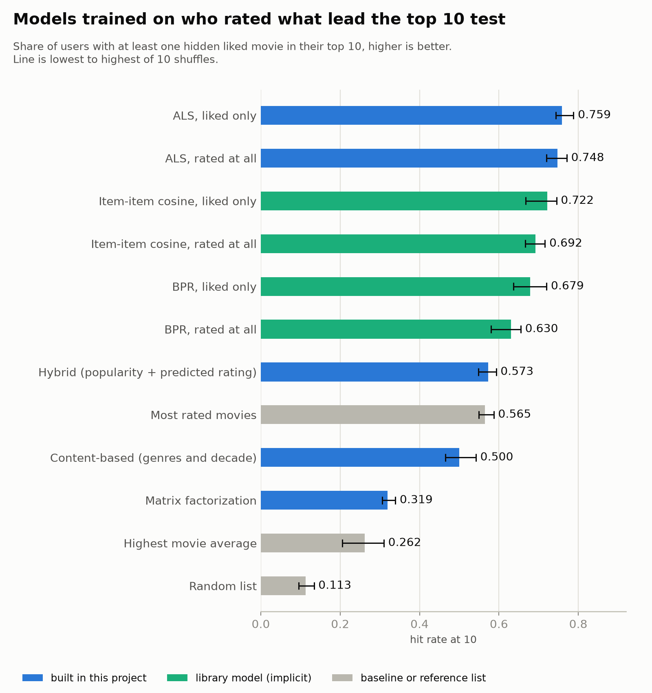
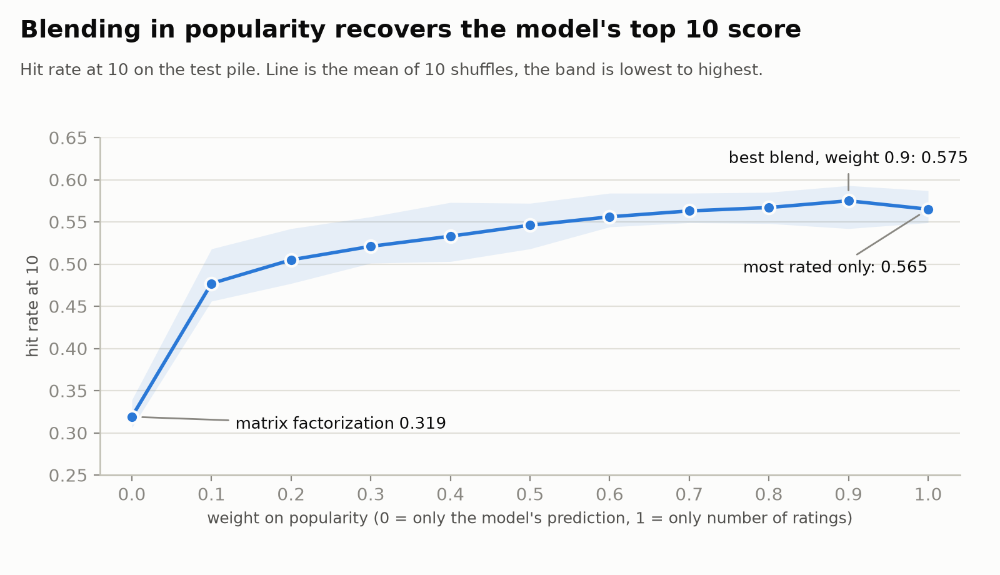
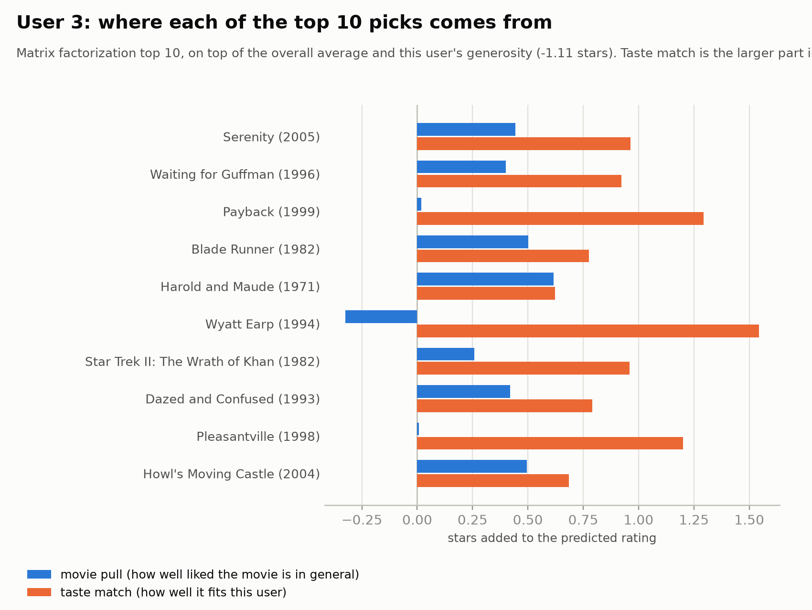
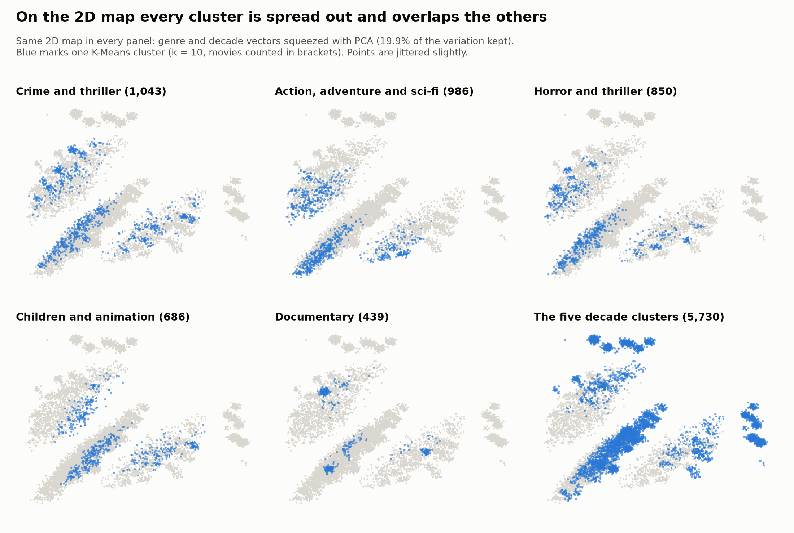

# Movie recommender on MovieLens

A recommender built from scratch on the MovieLens `ml-latest-small` data (100,836 ratings, 610 users, 9,742 movies). It has content-based similarity, a map of the movies, rating prediction with matrix factorization written in NumPy, a reason for every recommendation, and an evaluation that includes the places where it fails.

**Main finding.** Matrix factorization predicts ratings better than every baseline (RMSE 0.856 against 0.894 for the best baseline, better on 10 of 10 shuffles). As a top 10 list it loses to a plain list of the most-rated movies (hit rate 0.319 against 0.565). A library model trained on who rated what (ALS) beats both (0.744). Blending popularity into the model recovers the loss (0.573), but almost all of that score comes from popularity.

## The question

Can a recommender that only sees ratings, genres and tags predict ratings better than simple averages, produce top 10 lists better than "most popular", and say why it recommends each movie? And where does it fail?

Predicting a rating and ranking a list are different jobs, and a model can win one and lose the other. Every score here is measured on ratings the model never saw, as a mean with its lowest and highest value over 10 random shuffles, against baselines that have to be beaten. The failures are written up next to the successes.

## Data

[MovieLens `ml-latest-small`](https://grouplens.org/datasets/movielens/latest/): 100,836 ratings (0.5 to 5 stars, 1996 to 2018) by 610 users on 9,742 movies, plus genres and free-text tags. The data is not part of this repository.



- 98% of the user-movie table is empty. The median movie has 3 ratings and 3,446 movies have only one.
- There is no cast, director or plot. The content features are genres, the decade taken from the title, and user tags. Only 16% of movies have a tag, and one user wrote 41% of the tag rows.

Credit: F. Maxwell Harper and Joseph A. Konstan. 2015. The MovieLens Datasets: History and Context. *ACM Transactions on Interactive Intelligent Systems* 5, 4, Article 19. https://doi.org/10.1145/2827872. The GroupLens usage terms apply to the data.

## What is in it

- **Content-based similarity.** TF-IDF and cosine similarity on genres, decade and tags, first by hand in NumPy and checked against scikit-learn. Tag weights and tag cleaning were tested against a rating-gap measure, and genres plus decade alone scored best.
- **A map of the movies.** K-Means and a 2D PCA map of the content vectors.
- **Rating prediction.** Three baselines (overall average, movie average, movie average plus user bias) and matrix factorization trained with stochastic gradient descent in NumPy, with user and movie biases and regularization. Its settings were chosen on a validation pile, never on the test pile.
- **Explanations.** A reason for each recommendation, for both the content-based method and matrix factorization.
- **Evaluation.** RMSE, hit rate at 10, a similarity test, cold start, the biggest misses, and how popular each method's picks are.
- **A hybrid re-rank** of popularity and predicted rating, with its weight chosen on a validation pile.

## Results

Test pile, 10 shuffles, mean with lowest to highest in brackets. In each shuffle 20% of the ratings are hidden and every method learns from the other 80%.

| Model | RMSE in stars (lower is better) | Hit rate at 10 (higher is better) | Recall at 10 |
|---|---|---|---|
| 1. Overall average | 1.043 (1.032 to 1.050) | n/a | n/a |
| 2. Movie average | 0.977 (0.963 to 0.983) | 0.262 (0.205 to 0.310) | 0.034 (0.022 to 0.040) |
| 3. Movie average + user bias | 0.894 (0.881 to 0.899) | same as baseline 2 | same as baseline 2 |
| Content-based (genres and decade) | n/a | 0.500 (0.465 to 0.542) | 0.091 (0.082 to 0.105) |
| Matrix factorization | **0.856** (0.843 to 0.862) | 0.319 (0.306 to 0.339) | 0.047 (0.039 to 0.053) |
| Hybrid re-rank | n/a | **0.573** (0.548 to 0.593) | **0.124** (0.114 to 0.131) |
| Reference: random list | n/a | 0.113 (0.095 to 0.134) | 0.010 (0.007 to 0.014) |
| Reference: most rated movies | n/a | 0.565 (0.549 to 0.587) | 0.118 (0.110 to 0.127) |

Hit rate at 10 is the share of users who have at least one of their hidden liked movies (rated 4.0 or more) in their top 10. The candidates are movies with at least 20 training ratings. Baseline 3 has no separate hit rate because a user bias shifts every movie for that user by the same amount and cannot change the order.





- **Rating error.** Matrix factorization beats the best baseline on 10 of 10 shuffles, by 0.038 stars on average.
- **ALS by hand.** A NumPy version of the implicit ALS (48 lines in `src/als.py`) reproduces the library's hit rate with the same untuned settings (0.748 against 0.738 rated at all, 0.759 against 0.759 liked only), and each user solve matches the library's exact one to 8.5e-6.
- **Library top 10.** ALS, BPR and item-item models from `implicit`, trained on who rated what, beat the most-rated list on 10 of 10 shuffles (hit rate 0.744 to 0.758 for ALS, 0.692 to 0.722 for item-item, 0.630 to 0.679 for BPR, against 0.565). Ignoring the stars costs little. The test rewards predicting which movies people rate, and the library models were tuned on it while my matrix factorization was not, so this says what they predict, not that the lists please users more.
- **Library check.** Surprise `SVD` with the same settings scores 0.856, the same as the hand-written model, so the implementation is sound (tuned, the library reaches 0.851). Its regularized bias-only model scores 0.873, better than my baseline 3 (0.894), so against that baseline the gain of matrix factorization is 0.017 and not 0.038. The library fits in about 2 seconds, against about a minute here.
- **Top 10.** The non-personal most-rated list beats matrix factorization on 10 of 10 shuffles, and the content-based list beats it too. The model was trained to predict the stars of movies people rated, and the hidden liked movies are concentrated among the well-known ones. Its picks lean obscure (median 41 ratings against 62 for the hidden liked movies).
- **Content prior for new movies.** Giving a movie with no ratings the average bias of similar movies (genres and decade) made the error worse in 10 of 10 shuffles (1.034 against 1.026), because the movies it learns from are the well-liked ones with many ratings. It gains 0.001 to 0.005 stars at 2 to 19 ratings, and the overall RMSE does not move.
- **Time.** With the newest ratings hidden, every model gets worse and matrix factorization still comes first. Per-user cut: 0.891 against 0.939 for the best baseline. Global cut: 1.009 against 1.034, but 90.5% of that test is users who joined after the cutoff, so it mostly measures new users. Most users rate everything in one short sitting, so the cuts say little about taste changing over years. The hit rate was not rerun on them.
- **Hybrid.** Weighting the percentile of popularity and the percentile of predicted rating recovers the loss. The best blends put about 90% of the weight on popularity, and the hybrid beats the most-rated list by only 0.008 (higher in 7 of 10 shuffles), which is within the spread between shuffles.



- **Similar movies.** Content-based matches have a rating gap of 0.867 stars against 1.003 for random movies, and 0.954 for random movies that are as popular as the matches. The content-based list is lower on all 10 shuffles for each baseline.
- **Cold start.** Matrix factorization misses by 1.026 stars on a movie with no training rating and 0.964 for a simulated new user with none, against 0.856 on average. One rating is worse than none for the simple baselines. Details and the other tables are in [`results.md`](results.md).

## Explaining a recommendation

Each recommendation comes with a reason. For user 3, the first content-based pick and the first matrix factorization pick:

```
 1. Jurassic Park (1993)
     Shares genres Action, Adventure, Sci-Fi and Thriller and the 1990s decade with Escape from L.A. (1996), which you rated 5.0.

 1. Serenity (2005)  (predicted 3.80, 50 ratings)
     Prediction built from: overall average 3.50, your generosity -1.11, this movie's pull +0.44, taste match +0.96
     Its hidden numbers are closest to these movies you rated highly:
         Galaxy of Terror (Quest) (1981) (you rated 5.0, similarity 0.47, shares Action and Sci-Fi)
         Piranha (1978) (you rated 4.5, similarity 0.43, shares Sci-Fi)
         Saturn 3 (1980) (you rated 5.0, similarity 0.42, shares Adventure and Sci-Fi)
```

The split of the prediction into movie pull and taste match shows when a pick is personal and when it is only well liked by everyone.



## What failed

The full write-up, with the numbers and limits, is at the end of [`results.md`](results.md).

- **Matrix factorization loses the top 10 test** to the most-rated list, as above.
- **Tags did not help.** Raw tags made the similarity test worse, and cleaned tags only matched using no tags (0.869 against 0.867). Some searches broke on rare tags, for example The Matrix matched Sliding Doors and Karate Kid.
- **The content features are thin.** The 9,734 movies with a genre or year collapse into 2,216 distinct vectors, so many movies look identical to the model. Ties are broken by number of ratings, which pushes the content-based list towards popular movies.
- **The clusters are mostly genre and decade, with weak structure.** Silhouette scores are 0.20 to 0.25 and no k is clearly best. The 2D map keeps 19.9% of the variation.



- **The biggest misses look unpredictable.** The worst 1% of ratings are mostly 0.5 or 1.0 stars on movies the user usually rates high, and they make up 12.1% of the squared error.
- **The explanations are partial.** The prediction breakdown is exact, but the closest liked movies are a similarity view of the hidden numbers, not how the score is computed.
- **The evidence is weaker than it looks.** The 10 shuffles overlap, the hit rate test only counts movies people chose to rate and so favours popular ones, and the cold-start users are simulated.

## What I would try next

1. A test that does not only count movies users chose to rate, and wider search grids for the models trained on who rated what.
2. A content prior for new movies that is centred correctly, or content features with more than genre and decade.
3. The hit rate and the hybrid on the time-based cuts.
4. The 32M version of MovieLens, to see whether the ranking of the methods holds.

## Run it

Tested on Python 3.12. Run everything from the repository root.

```bash
python3 -m venv .venv
source .venv/bin/activate          # on Windows: .venv\Scripts\activate
pip install -r requirements.txt

mkdir -p data
curl -L -o data/ml-latest-small.zip https://files.grouplens.org/datasets/movielens/ml-latest-small.zip
unzip -j data/ml-latest-small.zip -d data
```

Reproduce the results table (about 6 minutes):

```bash
python src/results_table.py
```

| Command | What it does |
|---|---|
| `python src/results_table.py` | reruns every test and prints the tables above |
| `python src/demo.py 3` | top 10 with reasons from the three methods for user 3 (the first run fits the matrix factorization model, about 45 seconds) |
| `notebooks/demo.ipynb` | the same demo in a notebook, with charts and the hit rate results |
| `python src/make_plots.py` | redraws the charts in `docs/img/` |
| `python src/content_prior.py` | the content prior experiment (about 4 minutes) |
| `python src/als_check.py` | the hand-written ALS against the library (about 2 minutes) |
| `python src/library_hit_rate.py` | top 10 from library models trained on who rated what (several minutes) |
| `python src/library_compare.py` | the comparison with Surprise (about 5 minutes) |
| `python src/time_split.py` | the time-based split experiment (about 6 minutes) |
| `python src/hybrid.py` | the hybrid re-rank experiment (about 2 minutes) |

Every script uses fixed random seeds, so a rerun gives the same numbers.

## Repository layout

```
src/
  explore.py                           counts, sparsity and star values of the data
  split.py, baselines.py, mf.py        shuffled splits, the three baselines, matrix factorization
  movie_text.py, tfidf.py, cosine.py   movie text, TF-IDF and cosine similarity by hand
  similar.py, similarity_eval.py       "movies like this one" and the rating-gap test
  tag_weights.py, clean_tags.py        tag weight and tag cleaning experiments
  clusters.py, choose_k.py             K-Means, PCA map and the search for k
  choose_factors.py, choose_regularization.py   settings chosen on the validation pile
  final_score.py                       matrix factorization against the baselines (RMSE)
  explain_content.py, explain_mf.py, explain_als.py   reasons for recommendations
  hit_rate.py, hybrid.py               top 10 hit rate and the hybrid re-rank
  content_prior.py                     content prior for movies with few ratings (genres and decade)
  library_hit_rate.py                  top 10 hit rate of the implicit library models (needs implicit)
  als.py, als_check.py                 implicit-feedback ALS by hand and its check against the library
  library_compare.py                   my matrix factorization against Surprise (needs scikit-surprise)
  time_split.py                        time-based splits (oldest ratings train, newest test)
  popularity.py, cold_start.py, biggest_misses.py   the Part F analyses
  results_table.py, make_plots.py      final tables and charts
  demo.py                              command line demo
notebooks/demo.ipynb                   notebook demo
docs/img/                              charts used in this README and in results.md
results.md                             every result, with setup and limits
```
